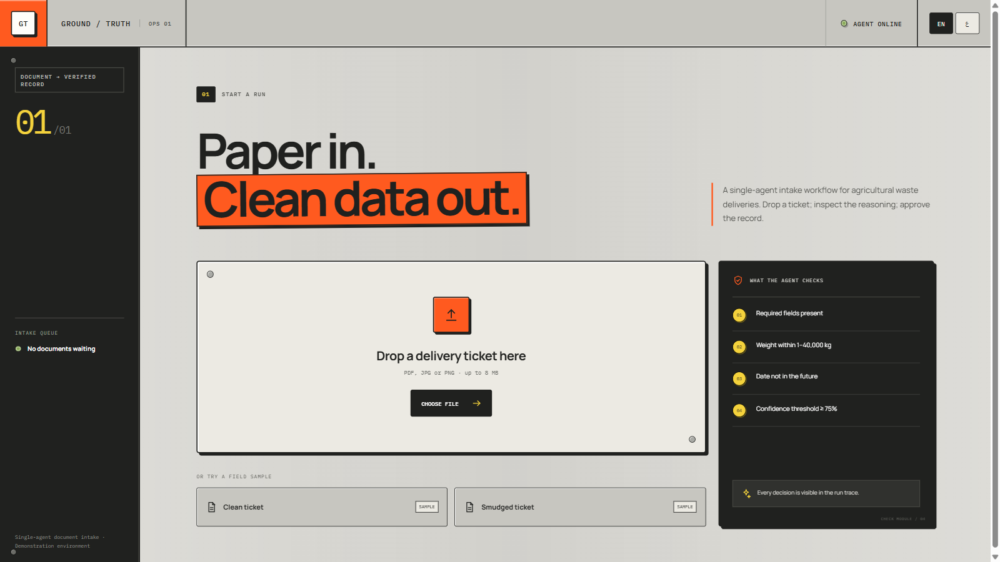
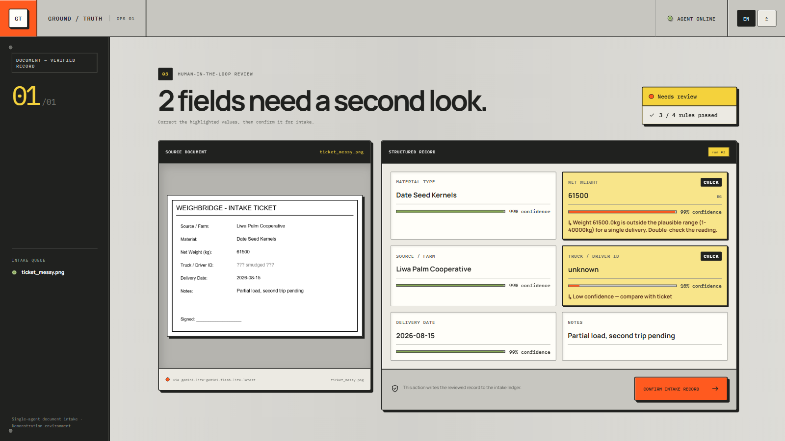
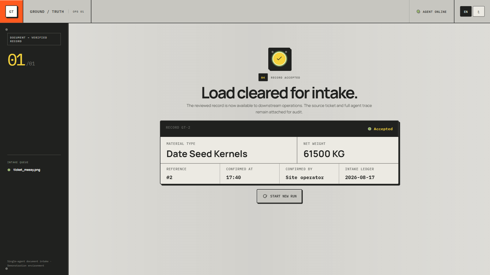
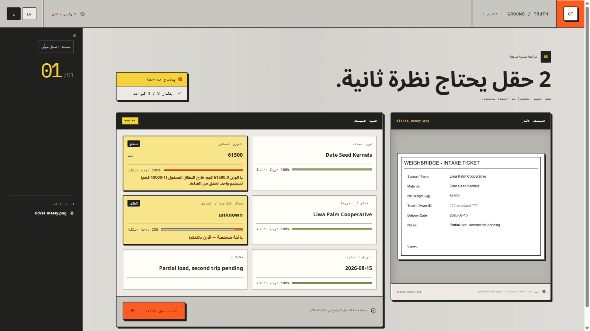

# Groundtruth

A document intake system: upload a photo or PDF of a delivery ticket, and an LLM agent reads it, extracts a structured record, checks it against business rules, and hands it back for a quick human confirmation. Fields the model isn't confident about get flagged for review before the record ships.

Everything on screen is wired to a real backend. The screenshots below are actual runs, not mockups.

| | |
|---|---|
| <br>**1. Upload screen**: the starting point, before a document is submitted. | <br>**2. Flagged review**: a real run against a smudged sample ticket. The flagged field, the warning, and the "2 fields need a second look" count all came from that actual response. |
| <br>**3. Confirmed receipt**: after a human approves the record, showing the real database-assigned ID and timestamp. | <br>**4. Arabic (RTL)**: the same screen in Arabic, with the full layout mirrored, and not just the text translated. |

## What it does

- Reads a photographed or scanned document and pulls out a structured record (vendor, weight, date, and so on).
- Tries multiple LLM providers in order and automatically falls back if one fails, so a single provider going down doesn't take the whole pipeline with it.
- Cross-checks every extracted field against business rules (required fields, numeric ranges, valid dates, allowed categories) and flags anything that fails.
- Routes low-confidence or rule-failing fields to a human for a quick edit before the record can be confirmed.
- Keeps every database read and write scoped to a client ID, the same isolation pattern a real multi-tenant system uses.
- Supports full English/Arabic bilingual UI, including complete right-to-left layout mirroring.

## Architecture

```
frontend/   React + TypeScript (Vite). Document preview, live agent trace,
            review UI, English/Arabic RTL support.
backend/    FastAPI.
  app/agent.py       runs the provider chain, validation, and trace/timing
  app/providers/     one module per LLM provider, same extract() interface
  app/validation.py  business rules (required fields, ranges, categories, dates)
  app/db.py          SQLite persistence, every table scoped by client_id
  app/security.py    upload verification, rate limiting
```

The provider chain is Gemini (flash), then Gemini (flash-lite), then OpenRouter (Nemotron VL), then OpenRouter (Gemma), all free-tier models. Each provider is a small file exposing the same `extract()` function, so adding a new one (Claude, OpenAI, a self-hosted model) means adding a file, not rewriting the chain. The failover path is tested by forcing a provider offline and confirming the next one in line picks up the request correctly.

## Setup

### Backend

```bash
cd backend
python -m venv .venv
source .venv/Scripts/activate   # .venv/bin/activate on macOS/Linux
pip install -r requirements.txt
cp .env.example .env            # fill in GEMINI_API_KEY and/or OPENROUTER_API_KEY
python -c "import secrets; print(secrets.token_urlsafe(32))"   # -> DEMO_API_KEY
python -c "from cryptography.fernet import Fernet; print(Fernet.generate_key().decode())"   # -> ENCRYPTION_KEY
python ../scripts/generate_sample_tickets.py   # writes test tickets, no real data needed
uvicorn app.main:app --reload --port 8000
```

Gemini keys are free at [aistudio.google.com](https://aistudio.google.com). OpenRouter keys are free at [openrouter.ai](https://openrouter.ai), no card required.

Every data endpoint needs a bearer token (see [SECURITY.md](./SECURITY.md)): generate `DEMO_API_KEY` and `ENCRYPTION_KEY` as shown above and add both to `.env`.

### Frontend

```bash
cd frontend
npm install
npm run dev   # http://localhost:5173, expects backend on :8000
```

Copy `.env.example` to `.env` and set `VITE_API_KEY` to the same value as the backend's `DEMO_API_KEY`. Set `VITE_API_BASE` too if the backend runs somewhere other than `http://localhost:8000`.

### Tests

```bash
cd backend
python -m pytest tests/ -v
```

26 tests covering the validation rules, the encryption round-trip (checked by reading the raw `.db` file directly, not just trusting the API), the upload and rate-limit checks, and a set of access-control regression tests written directly against a real vulnerability described in [SECURITY.md](./SECURITY.md).

## Security

Full detail, including the honest gaps, is in [SECURITY.md](./SECURITY.md). Summary:

- **Access control:** every data endpoint requires a bearer token, and the client ID is resolved server-side from that key rather than trusted from a client-supplied header. The earlier version trusted a client-supplied header, which meant anyone could read another client's records by changing it. That's fixed and covered by a regression test.
- **Encryption at rest:** personally identifying fields are encrypted with Fernet before being written to SQLite, confirmed by reading the raw database file and seeing ciphertext.
- **Input handling:** uploads are capped at 8MB and checked against their real file signature, not the client-supplied Content-Type header, which is easy to spoof.
- **Rate limiting:** a per-IP limiter on the extraction endpoint.
- **Secrets:** API keys live only in gitignored `.env` files or the host's own secret store, never in an API response.
- **Two real bugs found and fixed during testing:** a blocking LLM call inside an async route that froze the whole server for every other request while it ran, and a missing timeout on one provider that let a slow request stall the entire failover chain for close to a minute. Both are fixed and re-verified.

## Deployment

`deploy/render.yaml` deploys the backend to Render's free tier; `frontend/vercel.json` is set up for Vercel. Set the API keys as secret environment variables on whichever host you use, and point `VITE_API_BASE` at the deployed backend URL.
